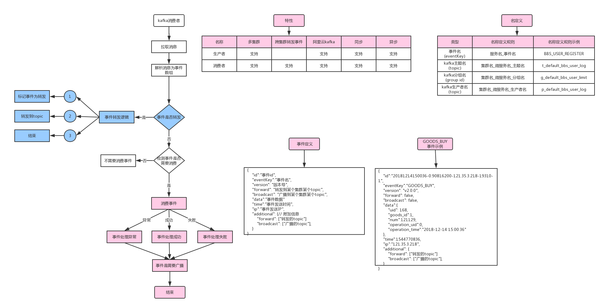

PHP Kafka
=====

介绍
----

Event Kafka是一个基于事件消费的kafka消费者和生产者, 你可以轻松使用示例和配置开发你的应用

开发文档
=====

|  名称     | 多集群   | 跨集群转发事件 | 阿里云kafka | 同步 | 异步 |
| -------  |:--------:| ------------| ----------- | --- | ---- |
| 生产者    | 支持     |              | 支持        | 支持 | 支持 |
| 消费者    | 支持     | 支持          | 支持       | 支持 | 支持  |


----
* **已撰稿** [介绍(Intro)](docs/md/0.0-INTRO.md)
* **已撰写** [安装(Install)](docs/md/1.0-INSTALL.md)
* **未撰写** [kafka消费者](docs/md/2.0-CONSUMER.md)




### 单元测试
```sh
phpunit --bootstrap ./tests/TestInit.php ./tests/

phpunit --bootstrap ./tests/TestInit.php ./tests/Heplers/CommonHelperTest.php
phpunit --bootstrap ./tests/TestInit.php ./tests/Events
```

### 常用命令示例

```sh
# 消费者示例
php AliyunAppEventConsumer 消费者客户端id
php examples\AliyunAppEventConsumer.php "consumer_client_id_1"

# 生产者示例
php AliyunSendAppEventProducer.php 发送次数 间隔时间  主题名 事件json字符串 分区[默认自动分区]
# 发送10次,每次间隔1秒,发送到"test_topic"主题, 事件内容是 "{}", 发送到默认自动分区
php AliyunSendAppEventProducer.php "10" "1"  "test_topic" "{}"

# 发送10次,每次间隔1秒,发送到"test_topic"主题, 事件内容是 "{}", 发送到1分区
php AliyunSendAppEventProducer.php "10" "1"  "test_topic" "{}" "1"

```

